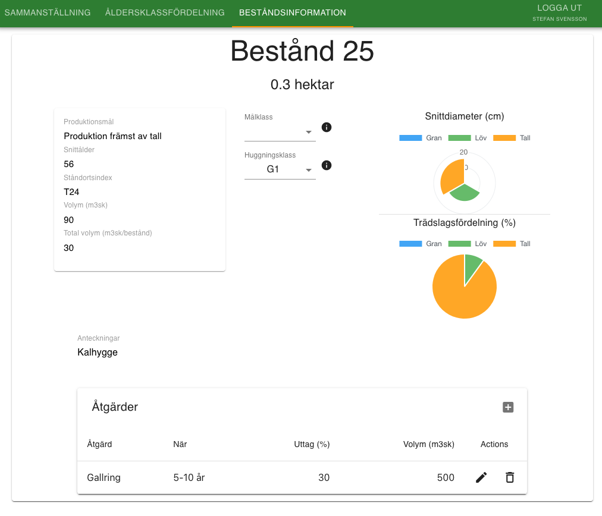

# Forestry

### Install

```node
npm install
npm start
```

### Technologies used

##### Main
 - React (Context API and routing)
 - Firebase for storage and authentication
 - Material.UI for navigation bars, buttons and theming
 - PrimeReact for bar and pie charts as it is a wrapper for ChartJS

#### Description

This is a web application to maintain and plan future logging operations of my of forest lands.

The application consists of three main views which can be toggled between and are complemented with the most important part of the project; the map showing all of the different logging regions visualized from GeoJSON data. The map is fully interactive and will display relevant metadata which is fetched from the database. For each region, a table displays for example tree age ranges, species distribution and much more. Another table displays past and future logging operations and is fully interactive for easy management.

#### Images
<div>
  
  
  
  
  
</div>
